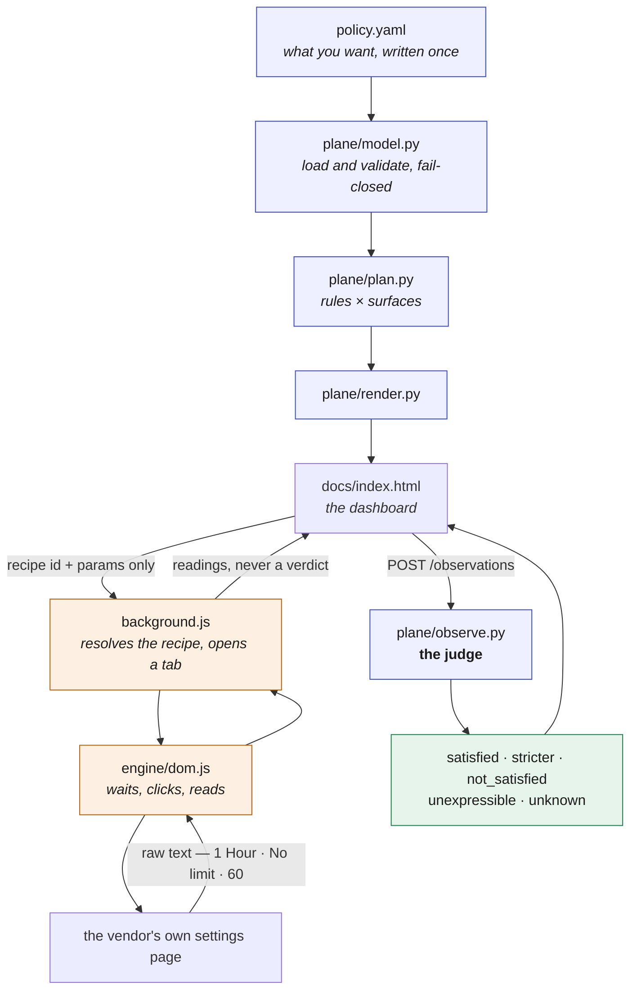
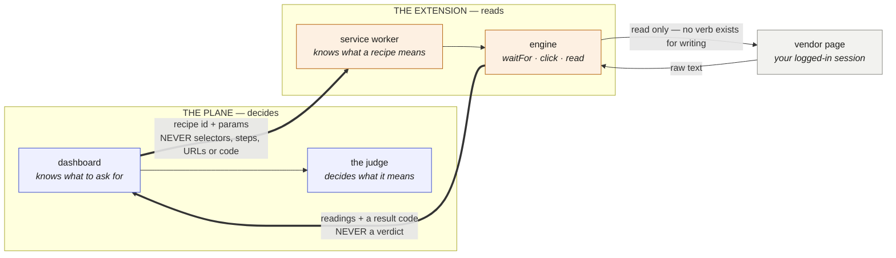
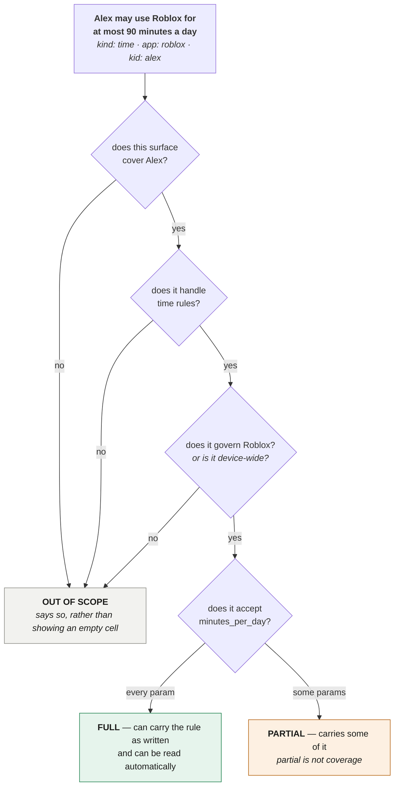

# Architecture

Four parts, and one rule about how they talk to each other.



The two coloured groups are the point: everything blue is the plane, everything amber is
the extension, and the only things that cross between them are a recipe id going one way
and raw page text coming back.

## The one rule: the extension reads, the plane judges

The extension returns **the text the page showed**. It never returns a verdict. Python
re-parses that text and decides what it means.

This is the load-bearing decision in the whole design. A component that both reads a
setting and rules on whether that setting is correct is grading its own homework — and
the failure is silent, because a reader that misparses will usually misparse in the
direction that makes it look successful. Keeping the judge on the other side of a
process boundary means the only thing that can be wrong is a string, and a wrong string
produces `unknown` rather than a confident lie.

It matters more, not less, if a write path is ever added. The thing that changes a
setting must not also be the thing that certifies the change worked.

## Read-only by construction, not by policy

The engine's entire action set is:

```js
ACTIONS = ["waitFor", "click", "read"]
```

There is no `setValue`, no `selectOption`, no `commit`. A verify recipe cannot change a
setting because the engine has no verb for it. This is enforced two ways — a test
asserts the action list, and a second test asserts that no shipped recipe contains a
write verb — so "read-only" is a property of the code rather than a promise in a README.

## What the page is allowed to send

The dashboard sends a **recipe id and parameters**. Nothing else. No selectors, no
steps, no URLs, no code.

The consequence is that a compromised or mistaken page cannot make the extension visit
an arbitrary site or run arbitrary DOM work in a logged-in session. The extension knows
what a recipe means; the page only knows what to ask for. The recipe's declared origin
is re-checked after URL templating, so a parameter cannot walk the tab off-origin.



Two crossings, and each is narrow on purpose. Outbound, a recipe id and parameters —
so a mistaken page cannot aim a logged-in browser session anywhere it chose. Inbound,
raw text and a result code — so the component that did the reading never gets to say
whether the reading was good news.

## One rule, many surfaces: the three gates

A rule reaches a surface only if all three are true. Anything else is not a gap you
should feel bad about — it is a fact about the vendor, and the page says which.



The fourth gate is the one that stops the whole thing being a lie. A surface can pass
the first three and still only honour *some* of the parameters — a vendor that does
daily limits but not per-day-of-week. It is listed, its shortfall is named, and it does
**not** count as covered. `COVERED_STATES` is a one-element tuple for the same reason.

## Verdicts, and why there are five

| verdict | meaning |
|---|---|
| `satisfied` | set to exactly what the rule asks |
| `stricter` | set tighter than asked — still in force |
| `not_satisfied` | set looser than asked |
| `unexpressible` | the vendor does not offer that value at all |
| `unknown` | the read did not complete, or the text was unreadable |

Only `satisfied` and `stricter` count as in force. That is one line of code:

```python
IN_FORCE = (SATISFIED, STRICTER)
```

`unexpressible` earns its place. "This vendor does not offer 90 minutes" and "you never
set it" produce the same empty cell and demand opposite actions — one sends you to
rewrite the rule, the other sends you to the vendor. Collapsing them into "not covered"
loses the only information that tells you which.

`unknown` earns its place too, and it is the one people get wrong. **A failed read is
never a verdict.** If the page did not load, or asked for a login, or showed a different
child, the result is `unknown` — never `not_satisfied`. "We could not look" and "it is
not set" are different facts, and a tool that conflates them will eventually tell someone
their child is unprotected because their wifi dropped.

## Vendor vocabulary lives in the catalog

Vendors word the same setting differently. One says `Older Kids`, another says `Mild`,
a third has no such level at all. The judge knows none of this. The translation lives in
`policy.yaml` beside the surface that needs it:

```yaml
maps:
  kids: "Little Kids"
  preteen: "Older Kids"
  teen: "Teens"
```

A test feeds the judge a deliberately **inverted** map — declaring that a vendor's
"Adults" means our "kids" — and asserts it follows the map anyway. A judge with its own
opinion about those words would disagree with the catalog, and then the catalog would be
decoration.

## Readiness is a selector, never a clock and never `status: complete`

`document.readyState === "complete"` fires before a single-page app renders, and fires
on the login page after a redirect. Both look like success. Readiness here is "the
recipe's anchor selector exists", polled — which also makes the login case free: while a
human signs in, the anchor simply is not there yet, and the run keeps waiting.

## Fail-closed loading

`plane/model.py` refuses rather than guesses. A surface that claims it `can` do
`content` without a `how` block describing the click-path fails the load. An unbacked
claim would otherwise render as a confident empty promise, which is worse than an
obvious gap.

## What is deliberately absent

- **Monitoring.** No usage, no activity, no messages, no location. The only things
  recorded are settings and your own confirmations. This is enforced structurally: a
  test whitelists every field that may reach the page, and a new one fails the build
  until someone justifies it in writing.
- **Writes.** See above — there is no verb for it.
- **A real vendor recipe**, in this repository. See the note at the top of the README.
- **Any claim that a setting is in force without having read it.** Unconfirmed is a gap.
